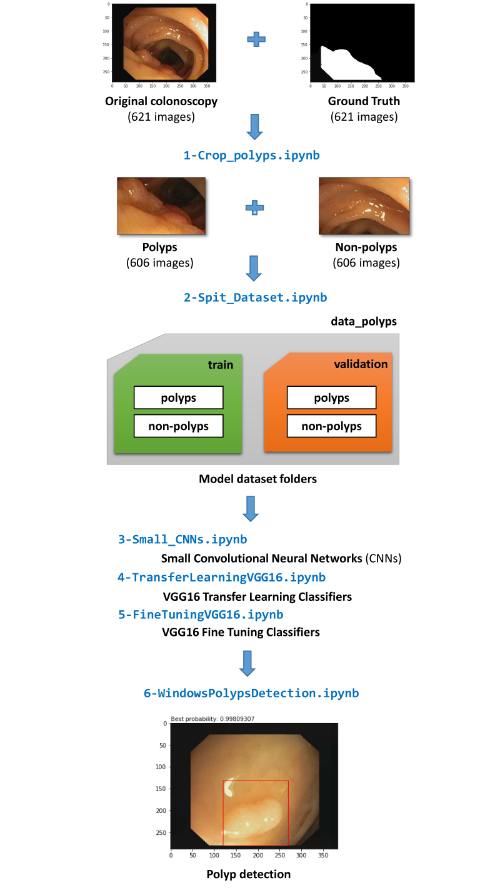

# CNN4Polyps - Colonoscopy polyps detection with CNN

## Description

This is a proof of concept repository for detection of polyps in colonoscopy images. Additional works should be done to obtain a better version of the image classifier and to create a Web/mobile app for this task.
The original dataset used for this study was downloaded from:
* http://site.uit.no/deephealthresearch/2017/07/19/polyp-detection-using-deep-learning/
* https://www.dropbox.com/s/p5qe9eotetjnbmq/CVC-ClinicDB.rar?dl=0

The following steps will be implemented into separated jupyter notebooks:
* [1-Crop_polyps.ipynb](1-Crop_polyps.ipynb): Crop the original images to extract smaller images with the polyps and non-polyps images; in addition, I eliminated the black margins to limit the future interference with the classifier.
* [2-Spit_Dataset.ipynb](2-Spit_Dataset.ipynb): Create the new dataset  by splitting the new images into a folder structures such as train/validation; each new folder will contain 2 subfolders for polyps and non-polyps.
* [3-Small_CNNs.ipynb](3-Small_CNNs.ipynb): Build first classifiers for polyps/non-polyps images using small CNNs (Convolutional Neural Networks); with only 2-3 convolutional layers is possible to obtain a validation accuracy over 90% (training of the entire CNN).
* [4-TransferLearningVGG16.ipynb](4-TransferLearningVGG16.ipynb): In the next step, I tried to apply transfer learning using pre-trained VGG16 networks (training only the last full connected layer). Similar results are obtained without searching a lot of hyperparameters.
* [5-FineTuningVGG16.ipynb](5-FineTuningVGG16.ipynb): The last step is trying to apply fine tuning of pre-trained VGG16 networks (training 1-2 Conv blocks + FC layer). I will show you that in only 2 minutes you can build a classifier with over 98% accuracy!
* [6-WindowsPolypsDetection.ipynb](6-WindowsPolypsDetection.ipynb): With a very simple script, it is possible to detect a polyp into a colonoscopy image (this is not the YOLO algorithm!).

**Folders**
* *download*: original downloaded dataset
* *cropped*: new images with polyps and non-polyps images
* *data_polyps*: the final dataset for the classifiers (train/validation subsets)
* *saved_models*: models saved with the notebooks (the large models are not saved!)
* *results*: extra results from these calculations
* *nets*: the downloaded VGG16 weights

### Acknowledgements
I gratefully acknowledge the support of NVIDIA Corporation with the donation of the Titan Xp GPU used for this research (https://developer.nvidia.com/academic_gpu_seeding). The entire project was done at RNASA-IMEDIR group, Computer Science Faculty, University of A Coruna, Spain.
